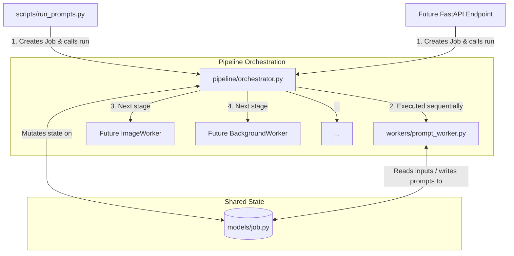

# Etsy Asset Generation Pipeline

[](https://github.com/astral-sh/ruff)
[](https://github.com/python/mypy)
[](https://www.python.org/)

A production-grade, modular, and scalable Python pipeline designed to automate the end-to-end generation, processing, and listing preparation of digital PNG clipart bundles for Etsy.

Designed for future deployment on Google Cloud Platform (GCP) and future orchestration by autonomous AI agents.

---

## 🏛️ Architecture Overview

The system is designed with a strict separation of concerns, decoupling configuration, orchestration, data models, and business logic.



### Key Architectural Patterns
* **Job-Centered State (`Job` Model):** A single Pydantic object holds all inputs, intermediate outputs, execution logs, and statuses. This object is mutated sequentially by each worker stage. There are no global variables.
* **Encapsulated Workers:** Every pipeline stage is implemented inside a self-contained `Worker` class exposing a single `run(job) -> job` entry point. Workers are stateless across job runs.
* **Zero-Logic Orchestrator:** The `Pipeline` class sequences workers, manages job state transitions, and records failures. It contains zero business logic.
* **Agent-Legible & Self-Documenting:** Contains lightweight `CONTEXT.md` files at every package level and an AST-generated static code graph at `.repo-graph/graph.json` to allow developers and AI agents to understand the repository structure instantly.

---

## 🔄 The Clipart Pipeline

The pipeline consists of 8 consecutive stages:


1. **Prompt Generation:** Uses Gemini 2.5 Flash + structured prompt-engineering skills to generate a batch of section-organized CLIP/diffusion prompts.
2. **Image Generation (ComfyUI):** Renders the prompts into high-resolution clipart designs using a local or cloud ComfyUI instance.
3. **Background Removal (rembg):** Removes backgrounds to produce transparent PNG files.
4. **Image Upscaling:** Upscales assets using scaling networks (e.g. Real-ESRGAN/UltraSharp) to print-ready resolution.
5. **Mockup Generation:** Creates beautiful product listing mockups and showcases.
6. **Metadata Generation (Gemini):** Automatically generates SEO-optimized listing titles, description sections, and 13 categorized tags.
7. **CSV Generation:** Bundles listing outputs into bulk-import CSV structures.
8. **Etsy Upload:** Uploads listings directly via the Etsy Seller API.

---

## 📁 Repository Structure

```
etsy-pipeline/
├── .repo-graph/
│   └── graph.json              # AST-generated static code graph
├── etsy_pipeline/              # Core installable Python package
│   ├── config/                 # Pydantic Settings & env-var loading
│   ├── models/                 # Shared data models (Job, StageResult)
│   ├── pipeline/               # Workflow Orchestrator
│   ├── resources/              # Self-contained prompt templates (SKILL.md)
│   ├── utils/                  # Exceptions, custom JSON & console logging
│   └── workers/                # Stage-specific Worker implementations
├── plans/                      # Persisted design and feature plans
├── scripts/                    # CLI entry points and developer tools
├── tests/                      # Pytest unit and integration test suite
├── pyproject.toml              # Build & dependency configuration
└── AGENTS.md                   # AI Agent workflow and coding guidelines
```

---

## 🚀 Getting Started

### Prerequisites
* Python 3.11 or later
* (Optional) [Google Cloud SDK (gcloud CLI)](https://cloud.google.com/sdk/docs/install) for Vertex AI mode

### 1. Installation
Clone the repository and install it in editable mode with development dependencies:

```bash
git clone https://github.com/janesh008/ETSY-pipeline.git
cd ETSY-pipeline
pip install -e ".[dev]"
```

### 2. Configuration
Copy the environment template and fill in your details:

```bash
cp .env.example .env
```

Open `.env` and configure your settings:
* **Vertex AI Mode (Recommended):** Set `USE_VERTEX_AI=True` and specify your `GCP_PROJECT_ID` and `GCP_LOCATION`. Run `gcloud auth application-default login` to authenticate.
* **API Key Mode:** Set `USE_VERTEX_AI=False` and fill in `GOOGLE_API_KEY`.

---

## 💻 CLI Usage

Run the prompt generation stage directly from the CLI:

```bash
python -m scripts.run_prompts --theme "Lilo & Stitch" --event "Normal"
```

### Available Arguments:
* `--theme`: Cartoon/character theme name (required, e.g. `"Mickey Mouse"`)
* `--event`: Event theme (defaults to `"Normal"`, e.g. `"birthday"`, `"baby shower"`)
* `--style`: Optional style hint override (e.g. `"watercolor"`, `"3D"`)
* `--count`: Optional prompt count override

Outputs are generated inside the configured `./output/` directory, saving both raw Gemini responses and parsed text files.

---

## 🛠️ Developer Commands

### Code Formatting & Linting
Run Ruff to format and lint check code:
```bash
ruff format .
ruff check .
```

### Static Type Checking
Verify type annotations:
```bash
mypy etsy_pipeline
```

### Run Tests
Execute unit tests (excludes real API calls):
```bash
pytest tests/ -v -k "not integration"
```

### Regenerate Code Graph
The code graph is generated statically using AST and is automatically updated during git commits:
```bash
python scripts/build_graph.py
```