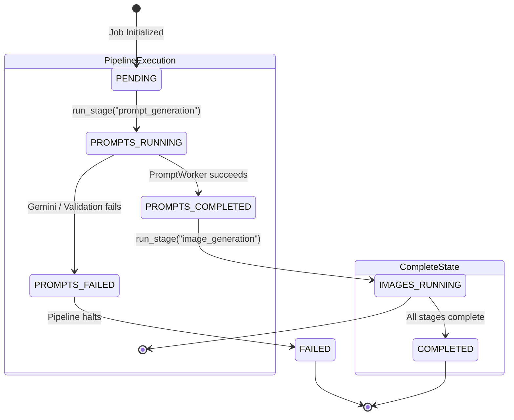

# Technical Architecture & System Design

This document details the software architecture, state machine logic, and GCP-readiness of the Etsy Pipeline.

---

## 🏗️ Layered Dependency Invariant

The project strictly follows a layered dependency rule. Imports must only flow **upward** in the package hierarchy:

```
[config]  ←  [models]  ←  [utils]  ←  [workers]  ←  [pipeline]  ←  [scripts]
```

*   **config** — Base configuration. Imports nothing.
*   **models** — Data models. Imports only from `config`.
*   **utils** — Shared exceptions and loggers. Imports from `config` and `models`.
*   **workers** — Component operations. Imports from `config`, `models`, and `utils`.
*   **pipeline** — Sequences worker execution. Imports from `config`, `models`, `utils`, and `workers`.
*   **scripts** — Entry point CLI scripts. Imports from everything.

---

## 🔄 Shared Job State Machine

The pipeline orchestrator schedules stage execution. The central state is governed by the `Job` model:



Every stage transitions the corresponding worker's `StageResult` status in the `Job.stages` dictionary:
1.  `StageStatus.PENDING`: Not started yet.
2.  `StageStatus.RUNNING`: Current worker is processing.
3.  `StageStatus.COMPLETED`: Worker completed successfully.
4.  `StageStatus.FAILED`: Worker raised an exception; execution halted.

---

## ☁️ Google Cloud Platform (GCP) Readiness

The package is fully optimized for GCP Vertex AI deployment:

*   **Unified SDK (`google-genai`):** Used for Gemini 2.5 Flash prompts and metadata generation.
*   **Vertex AI ADC Toggle:** Toggled via `USE_VERTEX_AI=True` in `.env`.
    *   **Local (False):** Authenticates directly using the `GOOGLE_API_KEY` token.
    *   **GCP (True):** Instantiates the client with `vertexai=True`, resolving credentials via Google's Application Default Credentials (ADC) from VM Service Accounts or Kubernetes Workload Identity.
*   **Structured JSON Logging:** Toggled via `LOG_FORMAT=json` in settings. Converts all application logs into structured JSON statements containing severity level, component path, and message string, which are natively parsed by Google Cloud Logging (Stackdriver).
