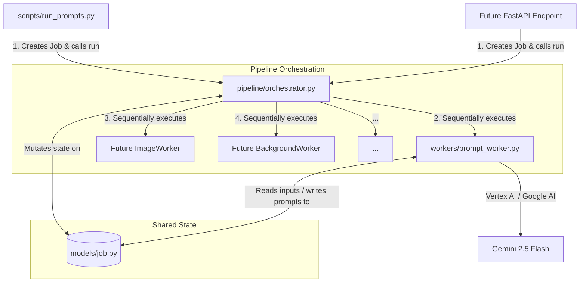
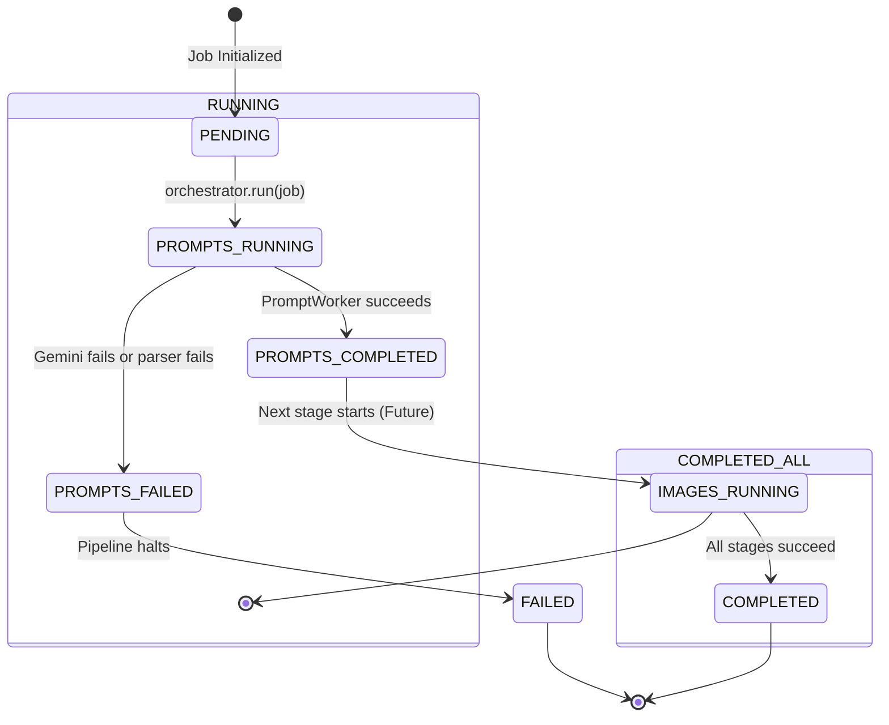

# Etsy Pipeline Architecture Overview

This document provides a comprehensive guide to the design, structure, and future-ready architecture of the `etsy_pipeline` project.

---

## 🏛️ Core Architectural Principles

The codebase has been designed to meet the strict requirements of a **production-grade, 5+ year maintainable AI platform** that will run on Google Cloud Platform (GCP).



### 1. Job-Centered State Machine (`Job` Model)
Instead of relying on global state, local file variables, or database calls at every step, the entire pipeline is structured around a single, serialized state container: the [Job](file:///d:/Janesh/ETSY/ETSY-pipeline/etsy_pipeline/models/job.py) model.
- **Data Flow**: Every worker receives the `Job` object, extracts what it needs, performs operations, saves outputs into the `Job`, and returns it.
- **Traceability**: The `Job` maintains active progress tracking (`stages` dictionary), error history, and system logs.
- **FastAPI Ready**: Since the `Job` is a Pydantic model, it can be parsed directly from JSON in a FastAPI request body and returned as a JSON response.

### 2. Encapsulated Workers (`Worker` Pattern)
Every stage of the pipeline resides inside its own dedicated module under `etsy_pipeline/workers/`.
- **Zero Inter-Stage Coupling**: No worker is aware of or calls any other worker. They only interact with the `Job` object passed to them.
- **Worker/Agent Split**: Each worker contains the execution business logic (e.g., calling Vertex AI or running ComfyUI). Later, wrapping these workers in an autonomous Agent framework (like LangGraph or custom agents) is trivial:
  ```python
  class ImageAgent:
      def execute(self, job: Job) -> Job:
          return ImageWorker().run(job)
  ```

### 3. Orchestration Layer (`Pipeline`)
The [Pipeline](file:///d:/Janesh/ETSY/ETSY-pipeline/etsy_pipeline/pipeline/orchestrator.py) orchestrator contains **zero business logic**. It only coordinates the workflow:
- Wires the sequence of worker executions.
- Handles exceptions gracefully, stops execution if a critical stage fails, and records the traceback into the `Job`.
- Tracks timestamps and sets the final job status (`JobStatus.COMPLETED` or `JobStatus.FAILED`).

### 4. Centrally Configured & Environment Aware (`Settings`)
Hardcoded variables (such as models, paths, folders, API parameters, or cloud bucket names) are banned. Instead, the [Settings](file:///d:/Janesh/ETSY/ETSY-pipeline/etsy_pipeline/config/settings.py) class loads configuration from:
1. Environment variables.
2. A local `.env` file (configured via `pydantic-settings`).
3. Standard defaults.

---

## 📂 Directory Structure and Module Map

Here is the functional map of the directory structure:

```
etsy-pipeline/
├── pyproject.toml              # Build & dependency specifications
├── .env                        # Local credentials & configs (ignored by Git)
├── .env.example                # Template for configuration
├── etsy_pipeline/              # Core python package
│   ├── config/
│   │   └── settings.py         # Application settings loaded via Pydantic
│   ├── models/
│   │   └── job.py              # Pydantic state models (Job, StageResult, JobStatus)
│   ├── pipeline/
│   │   └── orchestrator.py     # Pipeline execution manager
│   ├── utils/
│   │   ├── exceptions.py       # Hierarchy of custom pipeline exceptions
│   │   └── logging.py          # Structured JSON & Console logging
│   └── workers/
│       ├── prompt_worker.py    # Gemini Prompt Generator (Module 1)
│       └── prompt_worker_config.py # Constants and structures for PromptWorker
├── scripts/
│   └── run_prompts.py          # CLI tool to run the pipeline
└── tests/
    └── test_prompt_worker.py   # Unit & Integration tests for PromptWorker
```

### Module Roles and Responsibilities

- **`etsy_pipeline/config/settings.py`**: Defines the configuration schema. It uses `@lru_cache` to instantiate a single config instance throughout the process.
- **`etsy_pipeline/models/job.py`**: Defines the data models. A `Job` has input parameters (`theme`, `event_type`, `style_hint`), stage outputs (`prompts`, `generated_images`, `upscaled_images`, `mockups`, `metadata`, `csv_path`), and tracking parameters (`status`, `stages`, `errors`, `logs`).
- **`etsy_pipeline/utils/exceptions.py`**: Defines custom errors like `PromptGenerationError` and `PromptValidationError`. If any worker fails, it throws one of these specific exceptions, enabling the orchestrator to record exactly which stage failed.
- **`etsy_pipeline/utils/logging.py`**: Defines two formats. On a local machine, it writes readable, colorized lines to standard out. When deployed to GCP, it outputs structured JSON logs which are parsed natively by Google Cloud Logging (Stackdriver).
- **`etsy_pipeline/workers/prompt_worker.py`**: Contains the prompt-generation stage. It uses the `google-genai` SDK in one of two auth modes (Google AI Studio or Google Cloud Vertex AI) to send the system prompt (`SKILL.md`) and theme parameters to Gemini 2.5 Flash, parsing and validating the results.

---

## 🔄 State Transition Flow

Below is how a `Job` changes status as it moves through the stages of the pipeline:



---

## ☁️ GCP and Production Readiness

The architecture incorporates several structural components designed to ease the eventual migration to Google Cloud Platform:

### 1. Unified Client Authentication (Vertex AI & Google AI Studio)
The pipeline is designed to work both locally and in the cloud out of the box. By setting `USE_VERTEX_AI=True` in the environment, the codebase switches from direct API key mode to **Vertex AI Application Default Credentials (ADC)**. 
When deployed on a GCP Compute Engine instance or inside GKE (Google Kubernetes Engine) with Workload Identity, the worker automatically inherits credentials from the machine's Service Account, eliminating the need to manage API keys in code.

### 2. Standardized Filesystem Paths
The Job paths (`Job.get_output_dir()`) are generated dynamically based on settings. When migrating to GCP, the local directory paths can be modified to write directly to a mounted GCS bucket (using Cloud Storage FUSE) or using a GCS file manager service without changing the internal stage logic.

### 3. FastAPI and Container Compatibility
Because the pipeline uses standard python imports, lacks notebook-only components, and maintains thread-safe worker instantiations, it is fully compatible with ASGI servers like `uvicorn`. The entry point will simply initialize the `Pipeline` class and call `pipeline.run(job)` inside a route.
