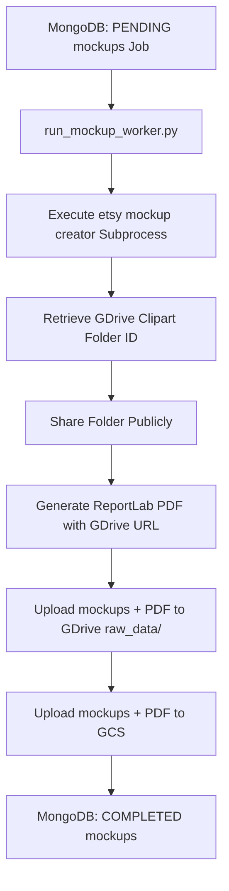

# Mockup & PDF Worker Documentation (`mockups.md`)

This document outlines the architecture, business logic, and coding rules for the `MockupWorker` module in `etsy_pipeline/workers/mockup_worker.py`.

---

## 🎯 Responsibility & Scope

The `MockupWorker` handles both mockup image creation and the PDF download catalog compilation.

### Business Rules:
1. **Mockup Generation**:
   - Executes the `etsy mockup creator` tool via Python subprocess inside its own directory (`cwd="etsy mockup creator"`).
   - Inputs: Transparent images from GCS/local `no_bg/`.
   - Outputs: PNG mockup images saved to `output/<date>/<theme_slug>/mockups/`.

2. **Google Drive Sharing**:
   - Locates the upscaled clipart folder in Google Drive (`Clipart/main_data/<date>/<theme_slug>/`).
   - Grants **Anyone with the link (Viewer)** permissions.
   - Obtains the public shareable link.

3. **PDF Generation**:
   - Uses `ReportLab` to compile a standard A4 one-page PDF wrapper.
   - Centered white card containing a preview image (first clipart file from `no_bg/`).
   - Interactive download button linking directly to the public Google Drive folder.

4. **Storage & Delivery**:
   - **Google Drive**: Delivers all mockups and the PDF to `Clipart/raw_data/<date>/<theme_name>/` (inside parent folder `1JWUBqtP-PG-hRLEQj4Kh_vNzfb_G_PCP`).
   - **GCS**: Uploads mockups to `Clipart/<date>/<theme_slug>/mockups/` and the PDF to `Clipart/<date>/<theme_slug>/pdf/`.

---

## 🏗️ Technical Architecture & Data Flow

---

## 💻 Code Structure

- **Worker Class**: `MockupWorker` (`etsy_pipeline/workers/mockup_worker.py`)
- **Config**: `etsy_pipeline/workers/mockup_worker_config.py`
- **CLI Daemon Script**: `scripts/run_mockup_worker.py`
