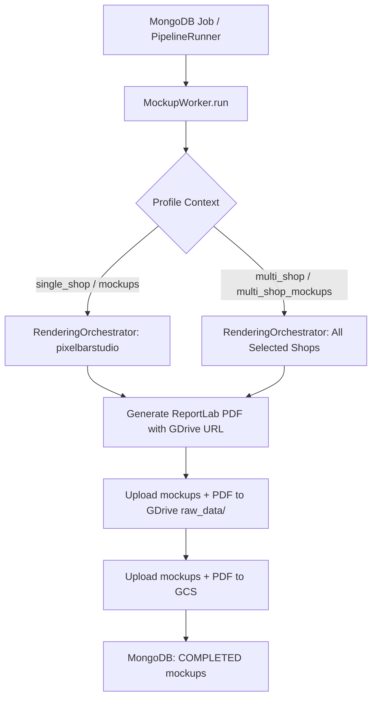

# Mockup & PDF Worker Documentation (`mockups.md`)

This document outlines the architecture, business logic, and coding rules for the `MockupWorker` module in `etsy_pipeline/workers/mockup_worker.py`.

---

## 🎯 Responsibility & Scope

The `MockupWorker` handles both mockup image creation and the PDF download catalog compilation.

### Business Rules:
1. **Mockup Generation (`single_shop` vs `multi_shop`)**:
   - **`single_shop` Pipeline (`mockups` stage)**: Uses `pixelbarstudio` only. Outputs saved directly to `output/<date>/<theme_slug>/mockups/`.
   - **`multi_shop` Pipeline (`multi_shop_mockups` stage)**: Uses all selected shops (`pixelbarstudio`, `luna_cliparts`, `crisp_png_co`). Outputs saved per-shop under `output/<date>/<theme_slug>/mockups/<shop_id>/`.
   - **Photorealistic Lifestyle Product Mockups**: Automatically dispatched for Shop 2 (`luna_cliparts`) using 4K upscaled assets from Google Drive `main_data`.
   - **Per-Shop Error Isolation**: Each shop in `multi_shop` is wrapped in a `try...except` block. A failure in one shop logs an error traceback and allows remaining shops to complete rendering safely.

2. **Google Drive Sharing**:
   - Locates the upscaled clipart folder in Google Drive (`Clipart/main_data/<date>/<theme_slug>/`).
   - Grants **Anyone with the link (Viewer)** permissions.
   - Obtains the public shareable link.

3. **PDF Generation**:
   - Uses `ReportLab` to compile a standard A4 one-page PDF wrapper.
   - Centered white card containing a preview image (first clipart file from `no_bg/`).
   - Interactive download button linking directly to the public Google Drive folder.

4. **Storage & Delivery**:
   - **Google Drive**: Delivers all mockups and the PDF to `Clipart/raw_data/<date>/<theme_name>/`.
   - **GCS**: Uploads mockups to `Clipart/<date>/<theme_slug>/mockups/` and the PDF to `Clipart/<date>/<theme_slug>/pdf/`.

---

## 🏗️ Technical Architecture & Data Flow

```mermaid
graph TD
    A[MongoDB Job / PipelineRunner] --> B[MockupWorker.run]
    B --> C{Profile Context}
    C -->|single_shop / mockups| D[RenderingOrchestrator: pixelbarstudio]
    C -->|multi_shop / multi_shop_mockups| E[RenderingOrchestrator: All Selected Shops]
    D --> F[Generate ReportLab PDF with GDrive URL]
    E --> F
    F --> G[Upload mockups + PDF to GDrive raw_data/]
    G --> H[Upload mockups + PDF to GCS]
    H --> I[MongoDB: COMPLETED mockups]
```

---

## 💻 Code Structure

- **Worker Class**: `MockupWorker` (`etsy_pipeline/workers/mockup_worker.py`)
- **Rendering Engine**: `RenderingOrchestrator` (`etsy mockup creator/rendering/plugins/orchestrator.py`)
- **Config**: `etsy_pipeline/workers/mockup_worker_config.py`
- **CLI Daemon Script**: `scripts/run_mockup_worker.py`
