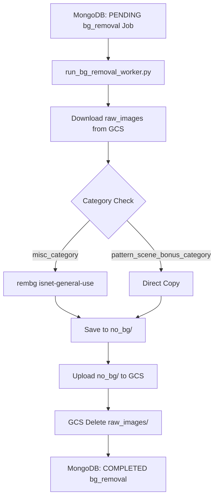

# Background Removal Worker Documentation (`remove_bg.md`)

This document outlines the architecture, business logic, and coding rules for the `BackgroundRemovalWorker` module in `etsy_pipeline/workers/bg_removal_worker.py`.

---

## 🎯 Responsibility & Scope

The `BackgroundRemovalWorker` processes generated raw clipart images for a theme and produces transparent PNG artifacts in the `no_bg/` directory.

### Business Rules:
1. **Category Partitioning**:
   - **`misc_category/`** (`MAIN_CHARACTER`, `SUB_CHARACTER_1..8`, `PROP`, `BANNER`, `FRAME_BORDER`, `CHARACTER_COMBO_*`, etc.):
     Processed using `rembg` with the `isnet-general-use` model to remove backgrounds and output transparent PNGs.
   - **`pattern_scene_bonus_category/`** (`PATTERN`, `SCENE`, `BONUS`):
     Skipped from AI background removal. Directly copied to `no_bg/pattern_scene_bonus_category/`.

2. **GCS Storage Cleanup**:
   - Downloads `raw_images/` from GCS (or processes local files).
   - Uploads transparent images to `Clipart/<date>/<theme_slug>/no_bg/misc_category/` and `Clipart/<date>/<theme_slug>/no_bg/pattern_scene_bonus_category/`.
   - On stage completion, issues a `gcs.delete_prefix("Clipart/<date>/<theme_slug>/raw_images/")` call to purge raw images and conserve bucket storage.

3. **Memory & Performance**:
   - Runs garbage collection (`gc.collect()`) and clears PyTorch CUDA cache (`torch.cuda.empty_cache()`) periodically during processing.
   - Uses `tqdm` to display visual progress in the terminal.

---

## 🏗️ Technical Architecture & Data Flow

---

## 💻 Code Structure

- **Worker Class**: `BackgroundRemovalWorker` (`etsy_pipeline/workers/bg_removal_worker.py`)
- **Exception Class**: `BackgroundRemovalError` (`etsy_pipeline/utils/exceptions.py`)
- **Config**: `etsy_pipeline/workers/bg_removal_worker_config.py`
- **CLI Daemon Script**: `scripts/run_bg_removal_worker.py`
