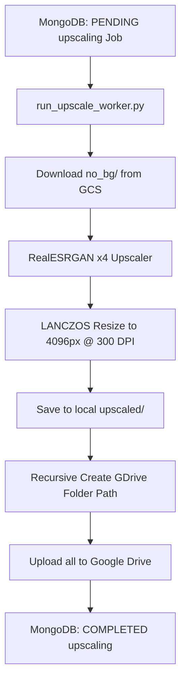

# Upscale Worker Documentation (`upscale.md`)

This document outlines the architecture, business logic, and coding rules for the `UpscaleWorker` module in `etsy_pipeline/workers/upscale_worker.py`.

---

## 🎯 Responsibility & Scope

The `UpscaleWorker` processes background-removed clipart images, upscales them using AI, standardizes their resolution to 4096px at 300 DPI, and delivers them directly to Google Drive.

### Business Rules:
1. **Source Images**:
   - Processes all images from `no_bg/` (scans both `misc_category` and `pattern_scene_bonus_category`).
   - Does **NOT** delete `no_bg/` files from GCS, as they are required downstream for mockup generation.

2. **Flattened Combined Output**:
   - Combines all upscaled images into a single directory per theme: `output/<date>/<theme_slug>/upscaled/`. No subfolder division is maintained in the final upscaled output.

3. **Google Drive Integration**:
   - Bypasses GCS upload for upscaled images.
   - Uploads all upscaled PNGs directly to Google Drive under the parent folder ID `1JWUBqtP-PG-hRLEQj4Kh_vNzfb_G_PCP`.
   - Organizes uploads into the nested path `Clipart/main_data/<date>/<theme_slug>/`.

4. **Upscaling Architecture**:
   - Uses `RealESRGANer` with `RRDBNet` (4x upscaling model and dynamic tile fallback: `512` → `256` → `128` on OOM).
   - Resizes final image to exactly **4096px on the longest side** at **300 DPI** using `PIL.Image.LANCZOS`.

---

## 🏗️ Technical Architecture & Data Flow

---

## 💻 Code Structure

- **Worker Class**: `UpscaleWorker` (`etsy_pipeline/workers/upscale_worker.py`)
- **Config**: `etsy_pipeline/workers/upscale_worker_config.py`
- **CLI Daemon Script**: `scripts/run_upscale_worker.py`
